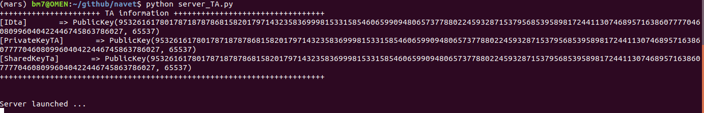
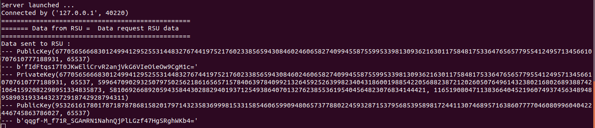
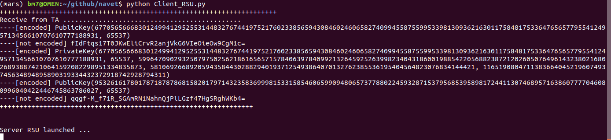
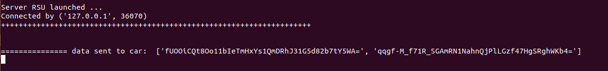
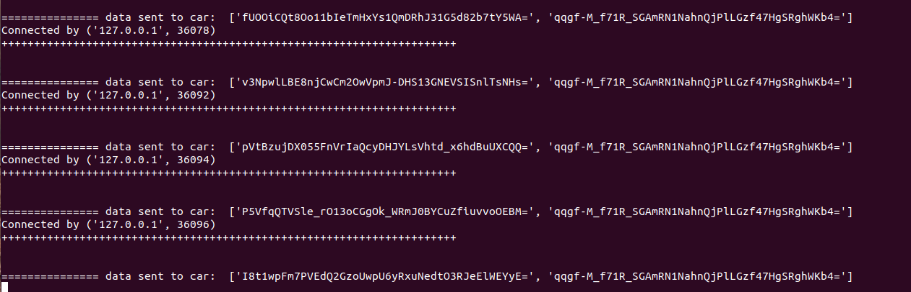
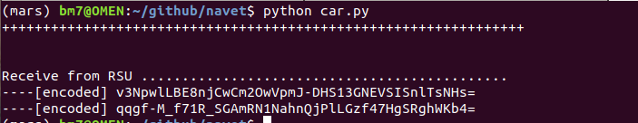

### VANET implementation in pyhton

This code has 3 part.

## 1. T.A 
#### Launch TA as server
```
python3 server_TA.py
```


#### ** print RSU request **



## 2. RSU
#### Launch RSU as server
```
python3 Client_RSU.py
```


#### ** print RSU request **


#### ** print RSU request **



## 3. car
#### Launch car as client with ticket
```
python3 car.py
```



